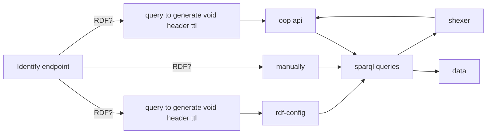

# Notes

## Workflow

```mermaid
graph LR
    A[Identify endpoint] -->|RDF?| B[query to generate void header ttl] --> C[oop api] 
    A -->|RDF?| F[query to generate void header ttl] --> G[rdf-config] --> D[sparql queries] 
    A -->|RDF?| H[manually] --> D[sparql queries] --> I[shexer] --> C[oop api] 
    D[sparql queries] --> E[data]
    C[oop api] --> D[sparql queries] 
```
